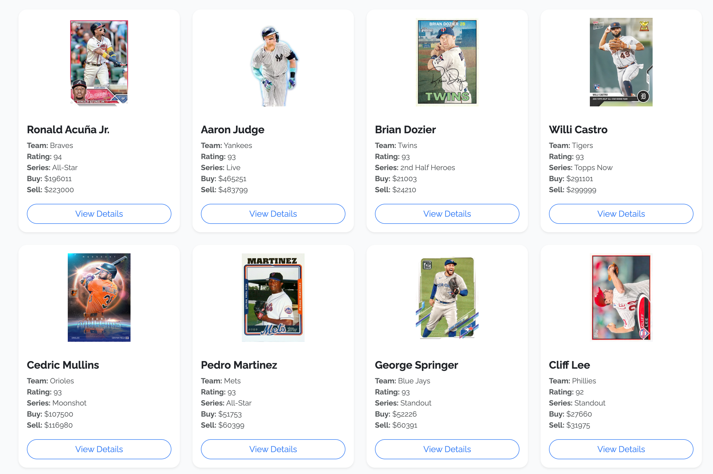
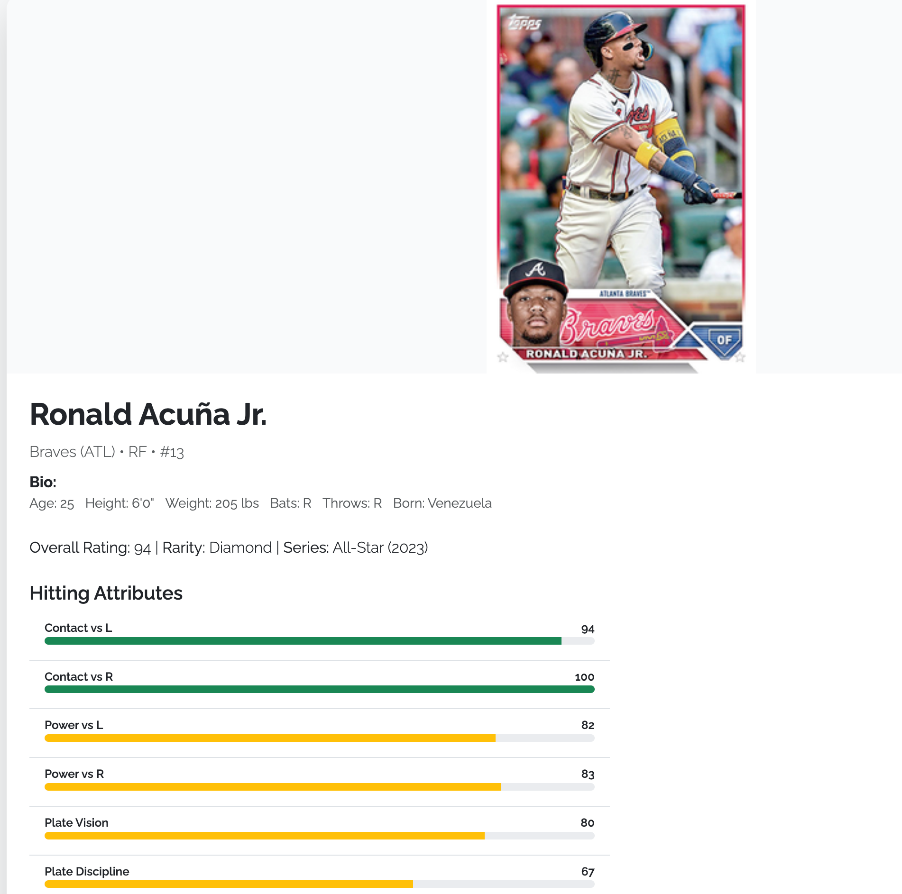
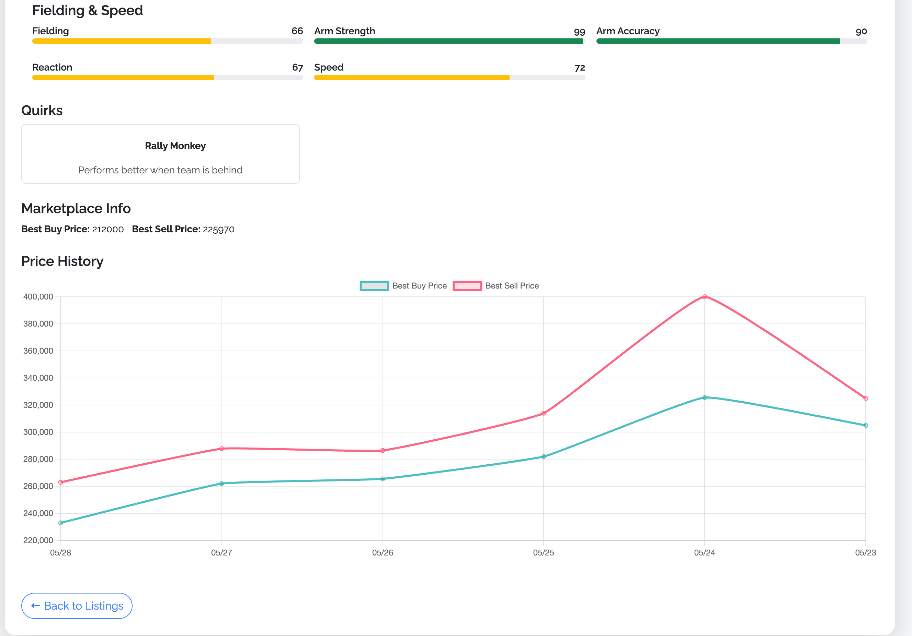

# MLB The Show 25 Listings

A dynamic Flask web application that displays player data and marketplace information from the official MLB The Show 25 API. Built with Python, Flask, Bootstrap, and Chart.js, this app allows users to browse player cards, view detailed stats, and analyze market trends through interactive charts.

## Features

- 🧢 **Player Listings** – Browse cards with images, names, and overall ratings.
- 📊 **Detailed Player Pages** – See full bio, attributes (hitting, pitching, fielding, speed), quirks, and marketplace prices.
- 🔍 **Player Search** - Search for any player currently available on the MLB The Show marketplace.
- 📈 **Interactive Charts** – Visualize sell and buy price trends using Chart.js.
- 🎨 **Attribute Sliders** – Color-graded sliders for visualizing key player stats.
- 📱 **Responsive Design** – Fully mobile-friendly with Bootstrap 5.
- 🆕 **Pagination Support** – Easily navigate through pages of listings.

## Tech Stack

- **Backend:** Python, Flask
- **Frontend:** HTML, Jinja2, Bootstrap 5, Chart.js
- **Data Source:** [MLB The Show 25 API](https://mlb25.theshow.com)

## Getting Started

### Prerequisites

- Python 3.x
- pip (Python package installer)
- A virtual environment (optional but recommended)

### Installation

1. Clone the repository:
   ```bash
   git clone https://github.com/EricKenji/mlb-the-show-app.git
   cd mlb-the-show-app
   ```
   
2. Install dependencies
   ```bash
   pip install -r requirements.txt
   ```
   
3.	Run the Flask app:
   ```bash
   flask run
   ```

4. Open your browser and go to:
   ```bash
   http://127.0.0.1:5000/
   ```
   
---

## Screenshots




---
